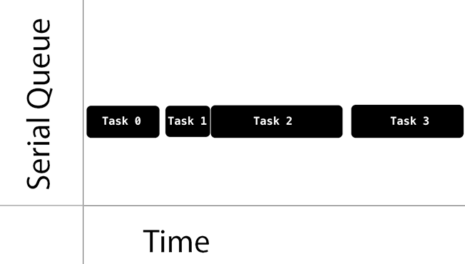
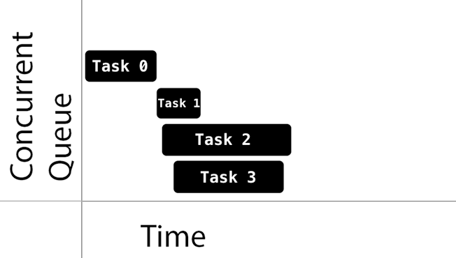

# __iOS Interview Review__

### Link to Stanford Course
https://www.youtube.com/watch?v=_lRx1zoriPo

### Credits

Credits for some of the conceptual explanations and images go to Ray Wenderlich and Apple Reference manual.

### Model View Controler

The **Model View Controller (MVC)** architecture assigns every object a particular role: (1) model, (2) view, or (3) controller. Each of these roles are delegated specific tasks, in an effort to create a better means of abstracting the application and to prevent one object file from getting too cluttered.

1. **Model** ("The Brains"): The instance where data should reside in. Things like persistence, model projects, parsing, and the like normally exist in here.
2. **View** ("The Face"): The face of the app; what the uesr interacts with. Contains classes that are typically reuseable. These views essentially do nothing -- they just look a certain way. It is up to the controller to link actions to these views.
3. **Controller** ("Nervous System"): Responsible for mediating user interaction with the view to how the model should react to that response.

**Note that the Model never directly interacts with the View. It _must_ go through the Controller.**


### Core Data

**Core Data** is an Apple frame that allows for data persistence between application launches. It is backed by SQLite but is not a relational database; more of an object-oriented database. 

With Core data, you create "entities" which are essentially class definitions in Core Data. Each of these entities can have attributes or pieces of information attached to that entity. Within your program, you can create or retrieve instances of these entities which can be saved through Core Data. Once saved, these entities can be fetched between app launches, and the data will continue to persist.


### Automatic Reference Counting (ARC)

**ARC** is a compiler feature that provides automati memory management for objects. Simply put, with ARC, objects that are no longer used are auomatically freed for other purposes. 

In order for ARC to understand which instances to be freed and which cannot, ARC maintains a chunk of memory that is allocated when a new instance is created that holds information regarding all the active references that reference that instance.

Consider the following example:

```swift
var reference1 = Person("David")
var reference2 = reference1
var reference3 = reference1
```

Even if we were to set `reference1 = nil`, the `Person` instance will not be deallocated until `reference2` and `reference3` are also set to `nil`.

The **strong** property means that an instances has a strong reference to that object, and as long as that strong instance exists, the object should not be freed. However, this potentially creates **strong reference cycles**, which is the major cause of **memory leaks**.

Consider the following example, where we create a variable `john = Person("John)` and `unit4A = Apartment("4A")`. Now we set `john.apartment = unit4A` and `unit4A.tenant = john`. Both strong references create a strong reference cycle. Now suppose we set `john = nil` and `unit4A = nil`. The Person instance and the Apartment instance both lose one instance each, **but they still reference each other!** Because each instance still has a reference (to one another), ARC will not deallocate them. Furthermore, since we no longer have a way to reference these instances, we effectively have a memory leak with allocated memory floating around.


One solution is to have one of the references be a **weak** reference. A weak reference is a reference that does not keep a strong hold on the instance it refers to, and so does not stop ARC from disposing of the referenced instance. A variable can be designated a weak reference using the following syntax: `weak var reference`.

With this in mind, suppose we use our same example as last time, differing in that `unit4A` maintains a weak reference to its `tenant`.


Now that `unit4A` has a weak reference to its tenant, the John instance does not include `unit4A.tenant` as a reference. So if we set `john = nil`, the John instance will no longer have any references to it and will therefore be deallocated by ARC


### Life Cycles

The **app lifecycle** can be summed up based on its loading delegate functions:

* `application: willFinishLaunchingWithOptions` -- Your application has its first chance to execute any code at all
* `application: didFinishLaunchingWithOptions` -- Perform final initializations before the app is displayed to the user
* `applicationDidBecomeActive` -- Your app is about to become put onto the foreground
* `applicationWillResignActive` -- Your app is about to resign foreground
* `applicationDidEnterBackground` -- Your app is now put into the background and may be suspended
* `applicationWillEnterForeground` -- Your app is about to be put from the background into the foreground
* `applicationWillTerminate` -- Your app is being terminated

 

In addition to the app lifecylce, there is also the **view lifecycle**, which can also be summarized by its delegate functions:

* `viewDidLoad` -- Called when you first create the class and load the view. Essentially, it is the `init()` call for a view and should be used to initialize any variables that you may need for this view
* `viewWillAppear` -- Called _every time_ right before your view appears. This is especially useful for refeshing a view or hiding/loading elements when you are navigating between views. That is, this function is called every time the view is left and later re-entered
* `viewDidAppear` -- Called when the view has appeared. Good for starting to display animations or UI behavior.
* `viewWillDisappear`/`viewDidDisappear` -- Same idea as `viewWillAppear` and `viewDidAppear` respectively, but for leaving the view behind. Good for saving changes or the state of the view before moving to another


### Grand Central Dispatch (GCD)

Multithreading in iOS apps is achieved by a low-level API called **Grand Central Dispatch** which manages concurrent operations in your application. When multithreading, blocks of code are added to _dispatch queues_, with GCD deciding which queues to run, essentially acting as a scheduler. <sup>1</sup>

##### Concurrent vs. Serial Queues

Queues are the main blocks of operations that get scheduled by GCD. These queues can be either **serial** or **concurrent**. _Serial queues_ guarantee that only one task runs at any given time. _Concurrent queues_ allow multiple tasks to execute at the same time.





##### Task Types and Quality of Service (QoS)

GCD provides three types of queues, each subclassing a _concurrent_ or _serial structure_

**Main Queue** The main queue is a serial queue whose items are run on the main thread.
**Global Queues** Global queues are concurrent queues shared by the whole system. There are a total of four global queues, which with its own priority: (1) high, (2) default, (3) low, and (4) background. 
**Custom Queues** Queues that you can set to be concurrent or serial and typically get handled by one of the global queues.

When setting up global queues, you do not specify  a priority. Rather, you specify a **quality of service (QoS)** value:

* user-interactive: This represents tasks that need to be done immediately. This often includes UI updates, event handling, etc. All user-interactive tasks should run on the main thread.
* user-inititated: This represents tasks that were started by the user and can be run asynchronously <sup>2</sup>
* utility: This represents tasks that may take some more time and may not finish right away, such as progress bars or retrieving data
* background: This represents tasks that isn't visible to the user such as backups, indexing, pre-fetching, etc.
* unspecified: This represents tasks that have the lowest priority

#### Creating Queues

Here are some calling conventions to create new dispatch queues:

```swift
func userInitiatedAsynch() {
    ...
    // Create a global queue with the userInitiated QoS
    DispatchQueue.global(qos: DispatchQoS.userInitiated.qosClass).asnych {
        // Run some given task asynchronously with the second highest priority
    }
    ...
}
```

```swift
func unspecifiedSynch () {
    ...
    // Create a global queue with an unspecified QoS
    DispatchQueue.global().synch {
        // Run some given task synchronously with the lowest priority
    }
    ...
}
```

```swift
func mainAsynch () {
    ...
    // Reference the main queue to run a task asynchronously
    DispatchQueue.main.asynch {
        // Run some given task asynchronously with the highest priority
    }
    ...
}
```

#### Networking

Networking is used when you want to request for data from the server via a network (e.g. looking for a picture via a URL or accessing data from a cloud database service). Here is an example of how to fetch an image, given a link to that image:

```swift 
let fetch = NSData(contentsOf: imageURL as URL)
```

Here is how you would make a GET request:

```swift
func makeGETCall() {
    let endpoint: String = "http://somereallink.com"
    guard let url = URL(string: endpoint) else {
        print("Error: Cannot create URL")
        return
    }
    
    let urlRequest = URLRequest(url: url)
    let config = URLSessionConfiguration.default
    let session = URLSession(configuration: config)

    // For session, you can also do session = URLSession.shared 
    // for default configurations
    
    let task = session.dataTaskWithRequest(urlRequest, completionHandler: {
        (data, response, error) in
        if (error != nil) {
            print("Error: \(error.localizedDescription)")
        } else {
            // Interact with the data
        }
    })
    task.resume()
}
```

#### Miscellaneous Reminders

The following are topics did not seem to be broad enough to need to dedicate a section for, but still important concepts to remember:

##### Struct vs. Class

Structs in Swift are pass-by-value instead of pass-by-reference. What this means is modifying one reference to a struct does not alter a reference to that struct. On the other hand, modifying a reference to a class changes that class instances for all references to it. (If it helps, try thinking of structs as customized primitives. For example:

```swift
struct Example {
    var topic: String = "Structs and classes"
}

var example1 = Example()
var example2 = example1

example2.topic = "Whoops... I didn't prepare two examples"

print(example1.topic)     // prints out 'Structs and classes'
print(example2.topic)     // prints out 'But I only had one example...'
```

On the other hand, suppose it were a class instead:

```swift
class Example {
    var topic: String = "Structs and classes"
}

var example1 = Example()
var example2 = example1

example2.topic = "Whoops... I didn't prepare two examples"

print(example1.topic)     // prints out 'But I only had one example...'
print(example2.topic)     // prints out 'But I only had one example...'
```

#### Setter Functions for Structs

In structs, setter functions that change a struct's attribute must be declared as a **mutating** function. If the struct was declared as a constant, then calling one of these mutating functions will fail on compile time.

```swift
public mutating func changeAttr(attr: AttributeType) {
    self.attr = attr
}
```

#### Constants

Constants declared with a `let` clause can only be assigned a value once. Subsequent definitions are invalid and will cause an error on compile-time. _However_, just because you cannot reassign a value, you can still change the value's attributes if the value is a class. For example, the follow is valid:

```swift
let example = Example()
print(example.topic)    // prints out 'Structs and classes'
example.topic = "Can we drop this example already?"     // valid
print(example.topic)    // prints out 'Can we drop this example already?'
```

#### Sorting Functions

Swift supports a built-in sort function for sorting values that implement the `Comparable` protocol. The general purpose sorting function that is used in Swift is called **introsort** which uses a combination of quicksort and heapsort. Introsort has a worst-case and average running time of _O (nlog(n))_. 

Here is an example of how you use the sorting algorithm:

```swift
let ascendingStudents = students.sorted()
let descendingStudents = students.sorted(by: >)
```

#### Guard Statements

You can use a `guard` statement in addition to `if let` unwrapping to unwrap an optional and check to make sure it does not contain a value that will break your program. For example, consider a simple dividing function. We want to make sure that the divisor is never zero. With `guard` statements, the function will look like this:

```swift
func divide(dividend: Double?, divisor: Double?) -> Double? {
    guard let dividend = dividend else { return .None }
    guard let divisor = divisor else { return .None }
    guard divisor != 0 else { return .None }    // divide by zero checking
    
    return dividend / divisor
}
```

Furthermore, you can group `guard` statements to make your code even simpler:

```swift
func divide(dividend: Double, divisor: Double?) -> Double? {
    guard let dividend = dividend,
              divisor = divisor where divisor != 0 else { return .None }
              
    return dividend / divisor
}
```

---------------------------

1. In iOS, dispatch queues are executed in FIFO order.
2. A synchronous task is one that will only return control after the task has fully been realized. Because synchronous tasks "block", they create bottlenecks for the rest of the programs that are running. This is one of the main reasons why UI updates should be done asynchronously and also why utility tasks should not be done on the main thread: imagine the user pressing a button but the main thread is still downloading 100GBs of data. It will take forever before the button handler is invoked. The solution is running asynchronous tasks, which do not block the current thread of execution from proceeding past that function call. These tasks typically involve a callback function that is called when the asynchronous task is complete.

